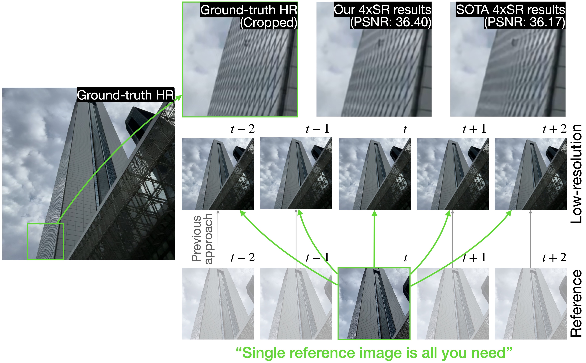
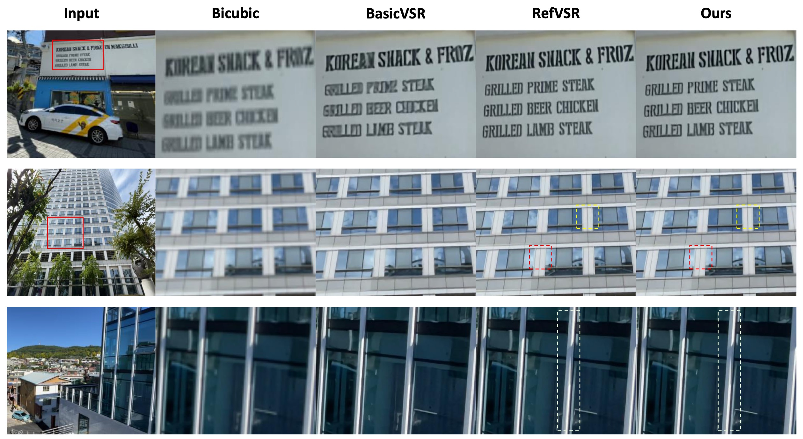

# CS570 Team Project: ERVSR
## Efficient Reference-based Video Super-Resolution (ERVSR)
### Framework Overview

### Results


## Minimal test
You can simply check the PSNR and visualized results of exemplary data **without any set-ups** via minimal_test.ipynb.

## Setting
1. Clone this repository
```
git clone https://github.com/haewonc/ERVSR.git
```
2. Match the dependencies following [RefVSR](https://github.com/codeslake/RefVSR).
3. Download the [RealMCVSR dataset](https://github.com/codeslake/RefVSR).
4. Download the pretrained [SPyNet](https://www.dropbox.com/s/cffujo2sjxiop0a/SPyNet.pytorch) and place inside the directory net/.

## Test 
You can reproduce the results in our paper with commands below. The testing with default configuration file should work on a machine with GPU memory larger than 6GB.
1. Download our pretrained [ERVSR model](https://www.dropbox.com/s/gruth7l24ejsgkt/final.pth) and place inside the directory results/saved_models/.
2. Run test.
```
python test.py --model results/saved_models/final.pth --data_offset $DATA_DIRECTORY$ --save_img True --save_dir results/test_imgs
```

## Train
You can train ERVSR model with the command below. The training with default configuration file should work on a machine with NVIDIA RTX TITAN (Memory: 24GB).
```
python train.py -b $BATCH_SIZE$ -data_offset $DATA_DIRECTORY$
```